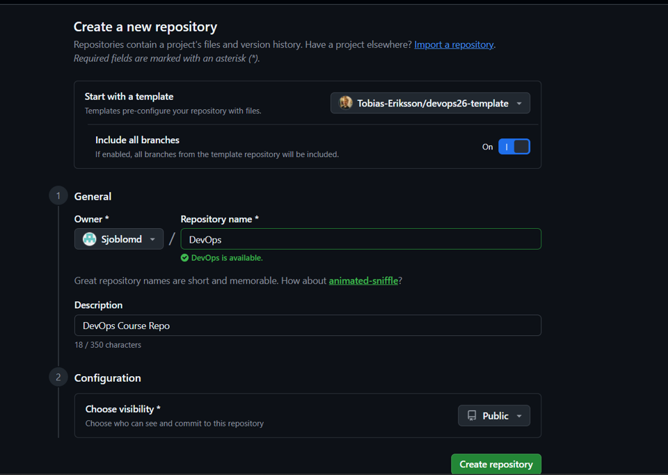
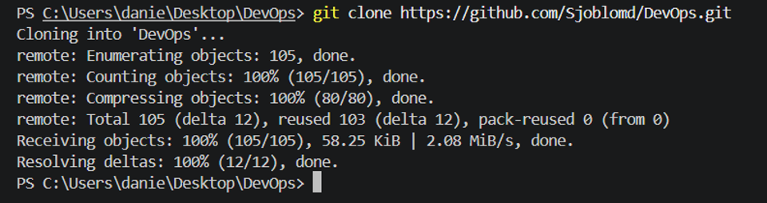
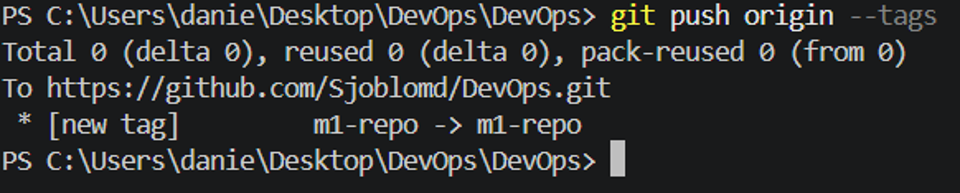

# M1 – Repository setup

## Vad vi gjorde utanför repot

Vi skapade vårt DevOps-repo från kursens template och inkluderade alla branches.
Vi klonade sedan repot och verifierade att vi kunde arbeta med det från terminalen.
Till sist skapade och pushade vi taggen `m1-repo` som markerar att milstolpen var klar.

## Skärmdumpar

### Repository created from template

### Repository cloned

### M1 tag pushed

