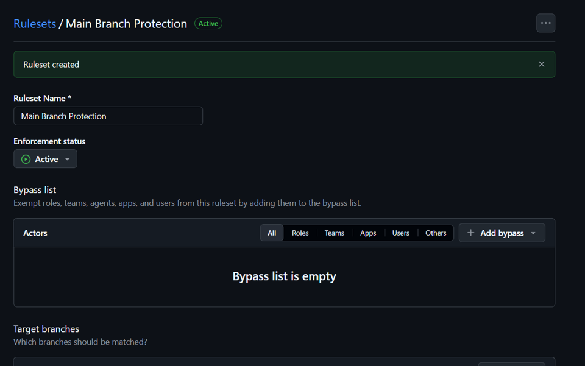
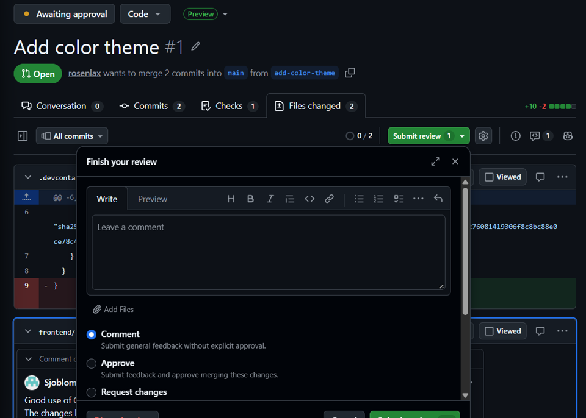
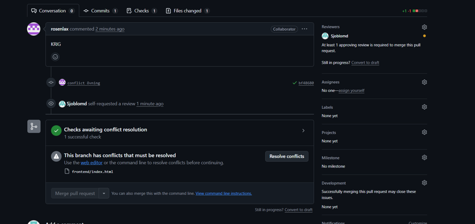
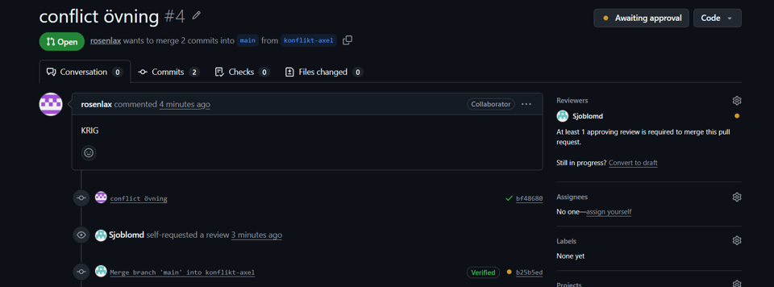

# M2 – Pull requests, reviews and conflicts

## Vad vi gjorde utanför repot

Vi skapade branch protection för main och krävde pull request och approval innan merge.
Vi arbetade i par och reviewade varandras pull requests innan de mergades.
Vi skapade också en merge conflict med flit genom att ändra samma del av samma fil på två olika branches.
GitHub blockerade mergen tills konflikten var löst, och efter att branchen uppdaterades kunde arbetet fortsätta.

## Skärmdumpar

### Main branch protection

### Buddy review

### Intentional merge conflict

### Conflict resolution

