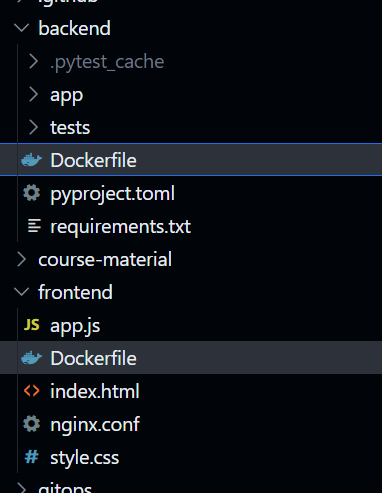
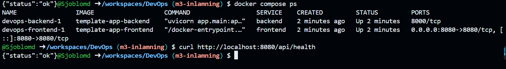
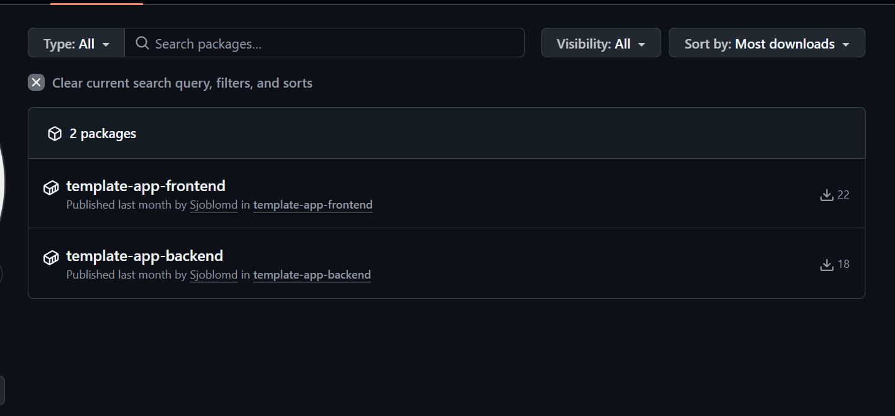

# M3 – Container

## Vad vi gjorde utanför repot

Vi skapade Dockerfiles för både backend och frontend.
Vi använde Docker Compose för att starta hela applikationen lokalt och verifierade att båda containrarna körde.
Vi testade också backendens health endpoint och fick `{"status":"ok"}`.
Till sist publicerade vi container images till GitHub Container Registry.

## Skärmdumpar

### Dockerfiles

### Docker Compose running

### GHCR images

