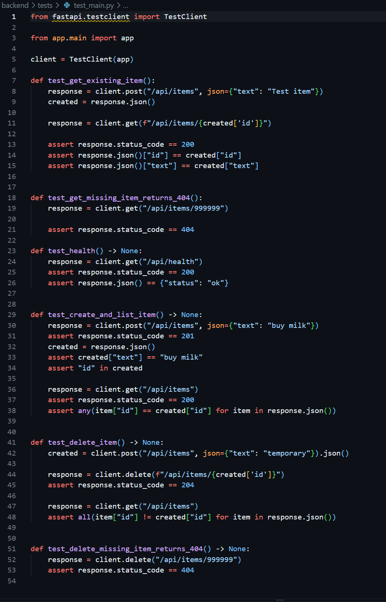
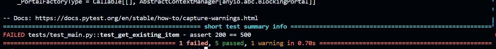
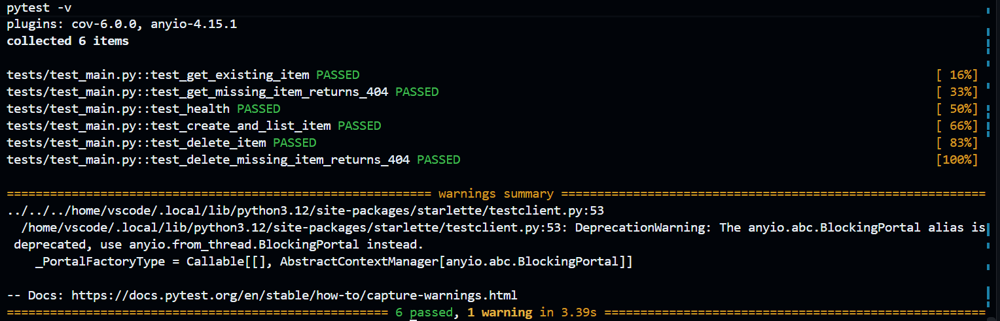

# M4 – Tests

## Vad vi gjorde utanför repot

Vi utökade backendens testsvit med fler tester.
Ett av testen misslyckades och visade att något i implementationen inte fungerade som förväntat.
Efter att felet rättades körde vi hela testsviten igen.
Alla sex tester passerade efter fixen.

## Skärmdumpar

### Extended test suite

### Bug found by test

### All tests passing

