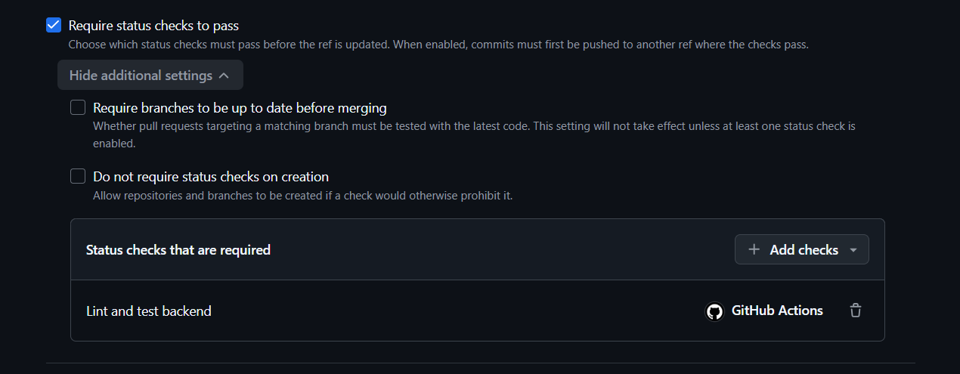
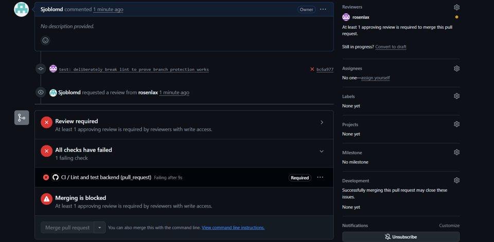
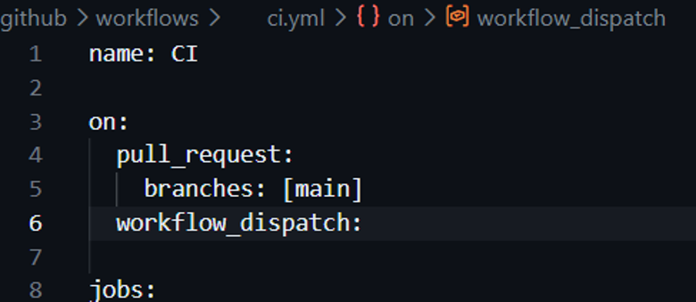
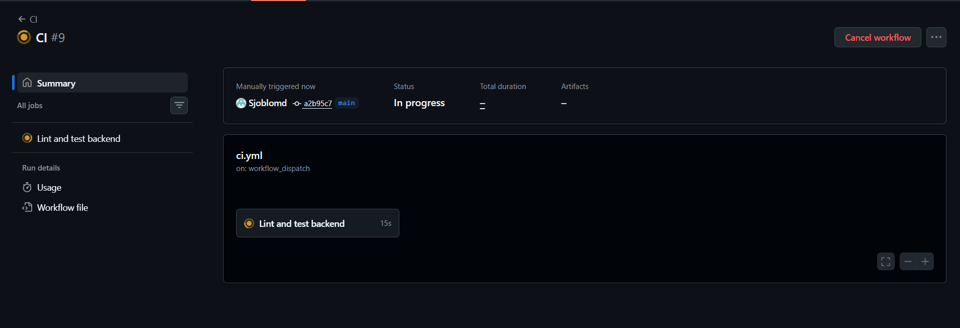

# M5 – Continuous Integration

## Vad vi gjorde utanför repot

Vi gjorde backendens lint- och test-workflow obligatoriskt för pull requests till main.
Vi skapade sedan ett medvetet lint-fel och verifierade att CI blev röd och blockerade merge.
Vi lade också till `workflow_dispatch` så att CI-workflowen kunde startas manuellt.
Till sist startade vi workflowen manuellt och kontrollerade att den kördes korrekt.

## Skärmdumpar

### CI required for main

### Broken build blocked

### Manual workflow trigger

### Manual CI run

