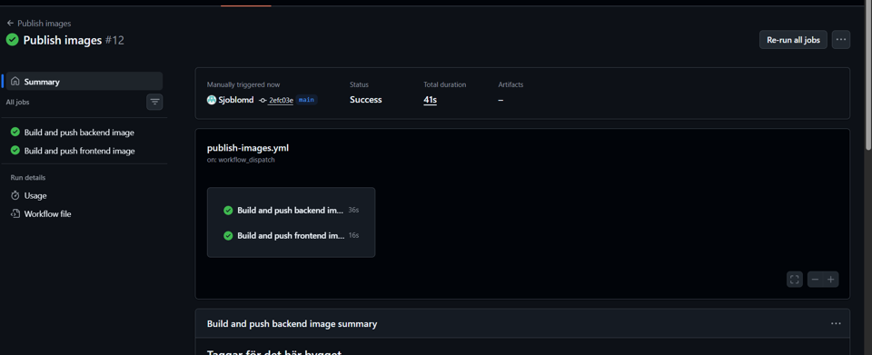
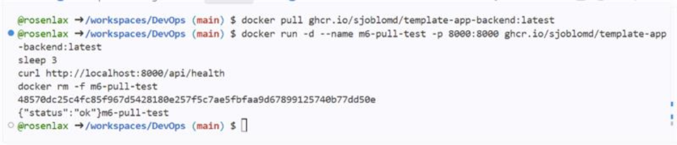
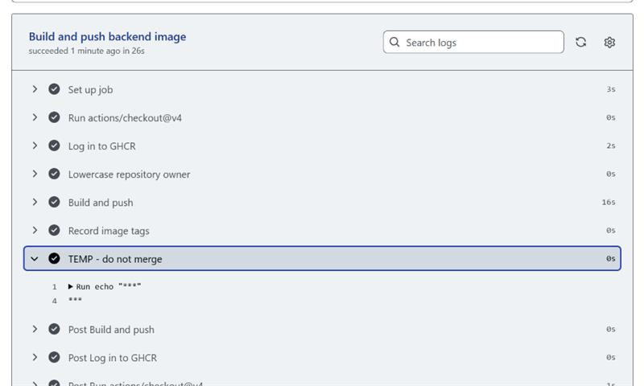

# M6 – Publish container images

## Vad vi gjorde utanför repot

Vi skapade ett GitHub Actions-workflow som bygger och publicerar backend- och frontend-images till GitHub Container Registry.
Vi verifierade den publicerade backend-imagen genom att pulla den från GHCR, köra den lokalt och testa `/api/health`.
Health-checken returnerade `{"status":"ok"}`.
Vi verifierade också att GitHub Actions maskerar hemligheter genom att kontrollera att `GITHUB_TOKEN` visades som `***` i workflow-loggen.

## Skärmdumpar

### Publish workflow

### Pull and run published image

### Secret masking

