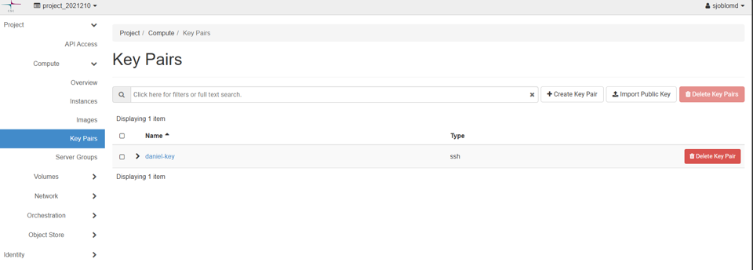
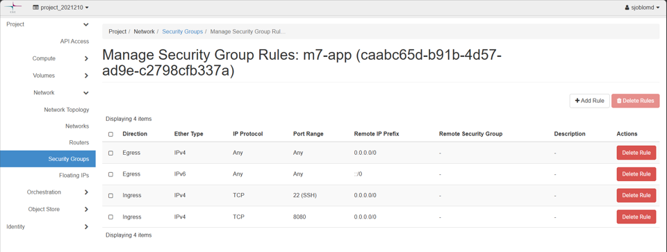
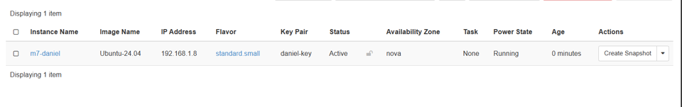
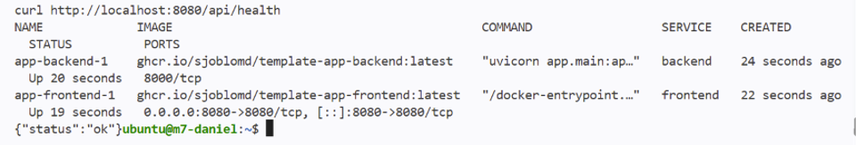
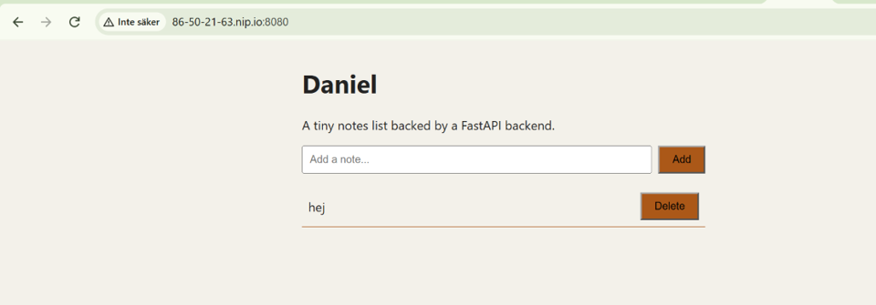

# M7 – Manual deployment to cPouta

## Vad vi gjorde utanför repot

Vi lade till våra SSH-nycklar i cPouta och skapade en security group som öppnade port 22 och 8080.
Vi skapade sedan en Ubuntu 24.04-VM och anslöt till den med SSH.
På VM:n installerade vi Docker och Docker Compose och startade backend och frontend med Docker Compose.
Vi verifierade att båda containrarna körde och att `/api/health` returnerade `{"status":"ok"}`.
Till sist verifierade vi att applikationen gick att nå från internet via VM:ns floating IP och nip.io-adress.

## Skärmdumpar

### SSH key pair

### Security group

### Ubuntu instance running

### SSH access and Docker

### Containers and health check

### Application reachable from the internet

