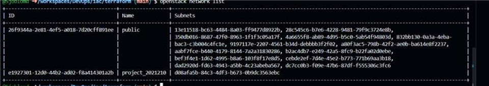
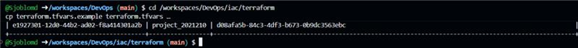
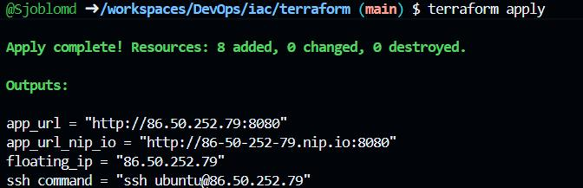
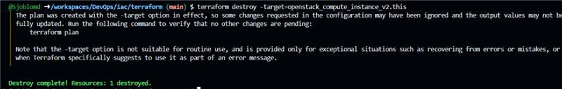
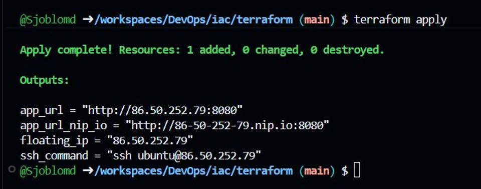

# M8 – Infrastructure as Code

## Vad vi gjorde utanför repot

Vi använde OpenStack CLI för att identifiera projektets interna nätverk och konfigurerade Terraform med rätt nätverk, GHCR owner, instansnamn och SSH-nyckel.
Vi körde sedan Terraform och skapade infrastrukturen i cPouta.
Den första deploymenten skapade åtta resurser och gav oss appens URL, nip.io-adress, floating IP och SSH-kommando.
För att verifiera att infrastrukturen kunde återskapas förstörde vi endast VM-resursen med en targeted destroy och körde sedan Terraform igen.
VM:n återskapades och samma floating IP behölls.

## Skärmdumpar

### Internal project network

### Terraform variables

### Initial Terraform deployment

### Targeted VM destroy

### VM recreated

