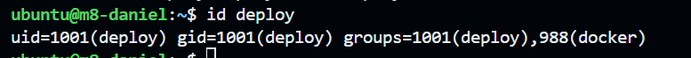
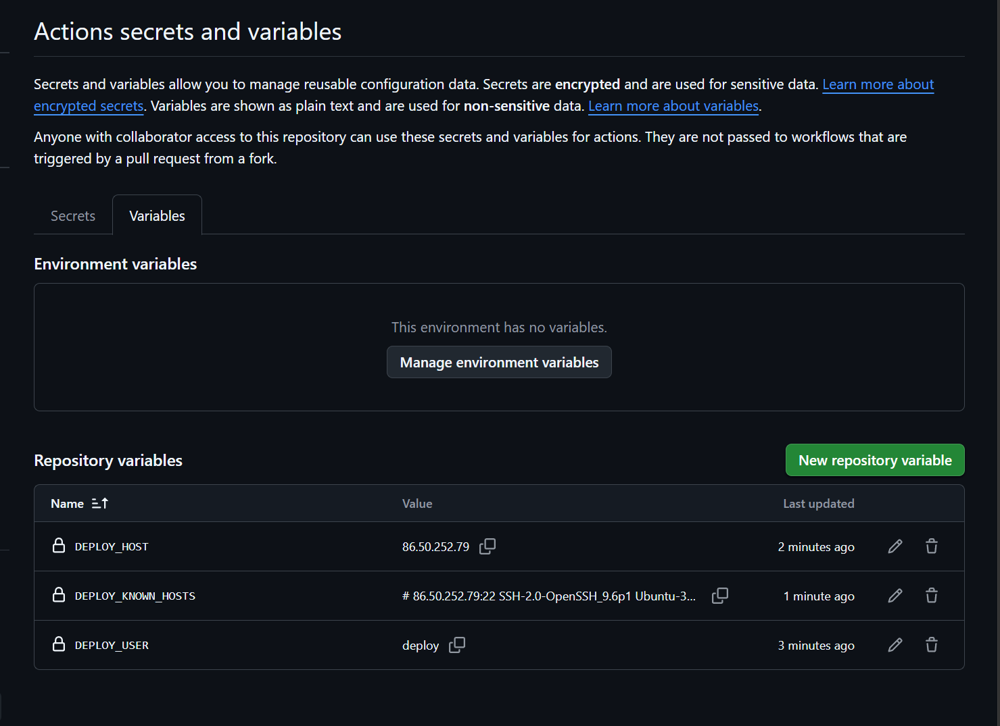
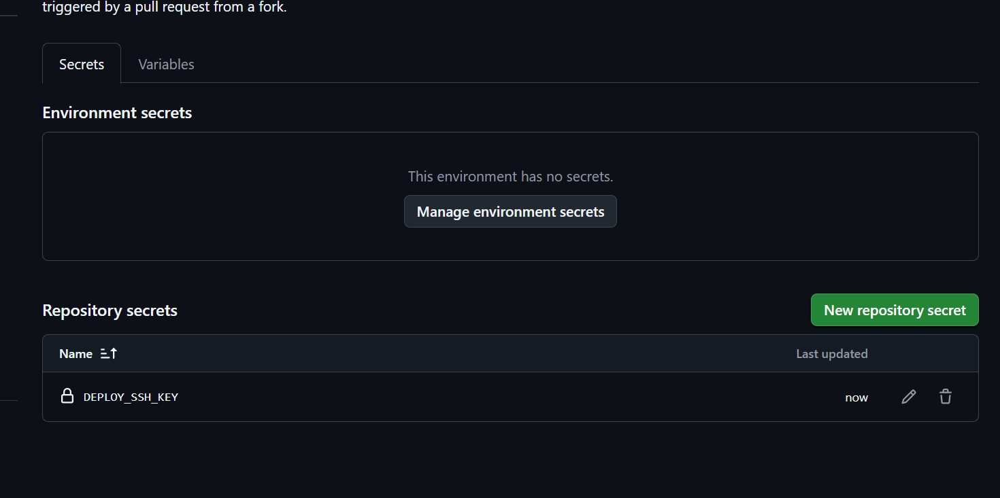
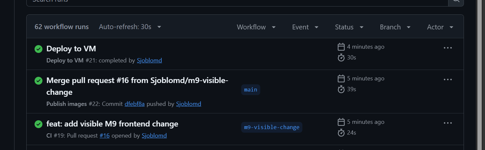
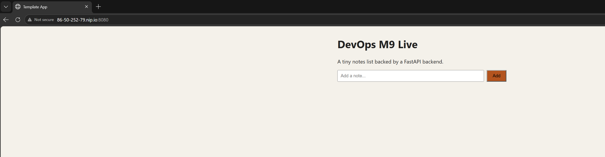

# M9 – Continuous Deployment

## Deploy user on VM

Vi skapade en separat användare `deploy` på vår cPouta-VM för att GitHub Actions skulle kunna deploya applikationen utan att använda admin-användaren.
Vi lade användaren i `docker`-gruppen och lade in en separat SSH-nyckel för deployment.
Med kommandot `id deploy` verifierade vi att användaren fanns och var medlem i `docker`-gruppen.

## GitHub secrets and variables

Vi lade in de variabler som deploy-workflowen behöver i GitHub Actions.
`DEPLOY_USER`, `DEPLOY_HOST` och `DEPLOY_KNOWN_HOSTS` sparades som repository variables och den privata SSH-nyckeln sparades som secreten `DEPLOY_SSH_KEY`.
Den privata nyckelns värde visas inte i GitHub och finns inte sparad i repot.

## Automatic deployment chain

Vi mergade en synlig ändring i frontend till `main`.
Efter mergen kördes först `Publish images`, som byggde och publicerade de nya container-images till GHCR.
När den körningen blev grön startade `Deploy to VM` automatiskt och uppdaterade applikationen på cPouta-VM:n via SSH.
Båda workflow-körningarna blev gröna.

## Application updated automatically

Efter den automatiska deploymenten öppnade vi applikationen via dess nip.io-adress.
Den nya frontend-ändringen syntes på sidan utan att vi behövde logga in på VM:n och deploya manuellt.
Vi verifierade också att `/api/health` fortfarande svarade med `{"status":"ok"}`.

